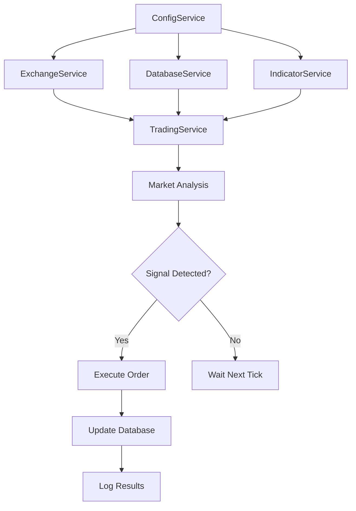

# Architecture du Bot de Trading - Guide du Développeur

## 🏗️ Structure du Projet

Le projet a été refactorisé en une architecture modulaire claire et maintenable :

```
tradingBot-v2/
├── src/
│   ├── config/
│   │   └── ConfigService.js          # Gestion centralisée de la configuration
│   ├── models/                       # Modèles de données
│   │   ├── BotStatus.js             # Statut du bot (IDLE/IN_POSITION)
│   │   ├── Position.js              # Position de trading active
│   │   ├── Trade.js                 # Historique des trades
│   │   ├── TechnicalIndicators.js   # Indicateurs techniques
│   │   └── index.js                 # Point d'entrée des modèles
│   ├── services/                     # Services métier
│   │   ├── DatabaseService.js       # Gestion SQLite avec transactions
│   │   ├── ExchangeService.js       # Interface avec Binance via CCXT
│   │   ├── IndicatorService.js      # Calculs RSI et Bollinger Bands
│   │   ├── TradingService.js        # Logique de trading principale
│   │   └── index.js                 # Point d'entrée des services
│   └── utils/
│       └── Logger.js                # Système de logs centralisé
├── app.js                         # Point d'entrée principal
├── package.json
└── .env.example
```

## 📋 Composants Principaux

### 1. **ConfigService** - Gestion de la Configuration
- **Responsabilité** : Chargement, validation et gestion des paramètres
- **Fonctionnalités** :
  - Validation automatique des variables d'environnement
  - Vérification de sécurité pour le trading live
  - Export/import de configuration
  - Mise à jour runtime des paramètres

```javascript
const configService = new ConfigService();
const tradingConfig = configService.getTradingConfig();
```

### 2. **DatabaseService** - Persistance des Données
- **Responsabilité** : Gestion SQLite avec transactions atomiques
- **Fonctionnalités** :
  - Prepared statements pour la performance
  - Transactions pour l'intégrité des données
  - Gestion automatique du schéma
  - Méthodes spécialisées par domaine

```javascript
const dbService = new DatabaseService('./bot.db');
dbService.initialize();
const position = dbService.getPosition();
```

### 3. **ExchangeService** - Interface avec Binance
- **Responsabilité** : Communication avec l'API Binance
- **Fonctionnalités** :
  - Gestion des ordres (création, suivi, annulation)
  - Récupération des données de marché
  - Vérification des soldes et limites
  - Gestion des timeouts et erreurs

```javascript
const exchangeService = new ExchangeService(config.exchange);
await exchangeService.initialize();
const ticker = await exchangeService.fetchTicker('BTC/USDC');
```

### 4. **IndicatorService** - Calculs Techniques
- **Responsabilité** : Calcul des indicateurs et analyse des signaux
- **Fonctionnalités** :
  - RSI et Bandes de Bollinger
  - Détection automatique des signaux
  - Analyse des conditions de marché
  - Statistiques avancées (volatilité, momentum)

```javascript
const indicatorService = new IndicatorService(config.indicators);
const indicators = indicatorService.calculateIndicators(ohlcvData);
const signals = indicatorService.analyzeSignals(indicators, currentPrice, symbol);
```

### 5. **TradingService** - Logique Métier
- **Responsabilité** : Orchestration des opérations de trading
- **Fonctionnalités** :
  - Analyse des ticks de marché
  - Exécution des ordres d'achat/vente
  - Gestion des positions
  - Calcul des profits/pertes

```javascript
const tradingService = new TradingService(
    exchangeService, 
    databaseService, 
    indicatorService, 
    config.trading
);
await tradingService.processMarketTick();
```

## 🔄 Flux de Données



## 🎯 Avantages de l'Architecture

### **Séparation des Responsabilités**
- Chaque service a une responsabilité claire et unique
- Facilite les tests unitaires
- Améliore la maintenabilité

### **Modularité**
- Services interchangeables (ex: changer d'exchange)
- Réutilisabilité des composants
- Extension facile (nouveaux indicateurs, stratégies)

### **Robustesse**
- Gestion centralisée des erreurs
- Transactions atomiques en base
- Validation stricte des configurations

### **Observabilité**
- Logging centralisé et structuré
- Métriques de performance
- Traçabilité complète des opérations

## 🚀 Utilisation

### Démarrage Standard
```bash
npm start
```

### Vérification Configuration
```bash
npm run config:check
```

### Sauvegarde Base de Données
```bash
npm run db:backup
```

### Mode Développement
```bash
npm run dev
```

## 🧪 Extension et Personnalisation

### Ajouter un Nouvel Indicateur
1. Étendre `IndicatorService.calculateIndicators()`
2. Mettre à jour le modèle `TechnicalIndicators`
3. Ajouter les paramètres dans `ConfigService`

### Ajouter une Nouvelle Stratégie
1. Créer un nouveau service dans `src/services/`
2. Implémenter l'interface de trading
3. Injecter dans le `TradingService` principal

### Changer d'Exchange
1. Créer un nouveau service d'exchange
2. Implémenter la même interface que `ExchangeService`
3. Changer l'injection de dépendance dans `app.js`

## 🔧 Configuration Avancée

### Variables d'Environnement Étendues
```env
# Nouvelles options de sécurité
MAX_DAILY_TRADES=50
MAX_DAILY_LOSS=100.0
EMERGENCY_STOP_LOSS=-10.0

# Options de performance
ORDER_TIMEOUT=30000
TICK_INTERVAL=10000

# Logging
LOG_LEVEL=info  # error, warn, info, debug
```

Cette architecture modulaire permet une maintenance aisée et une évolution continue du bot de trading tout en conservant la robustesse et les performances du système original.